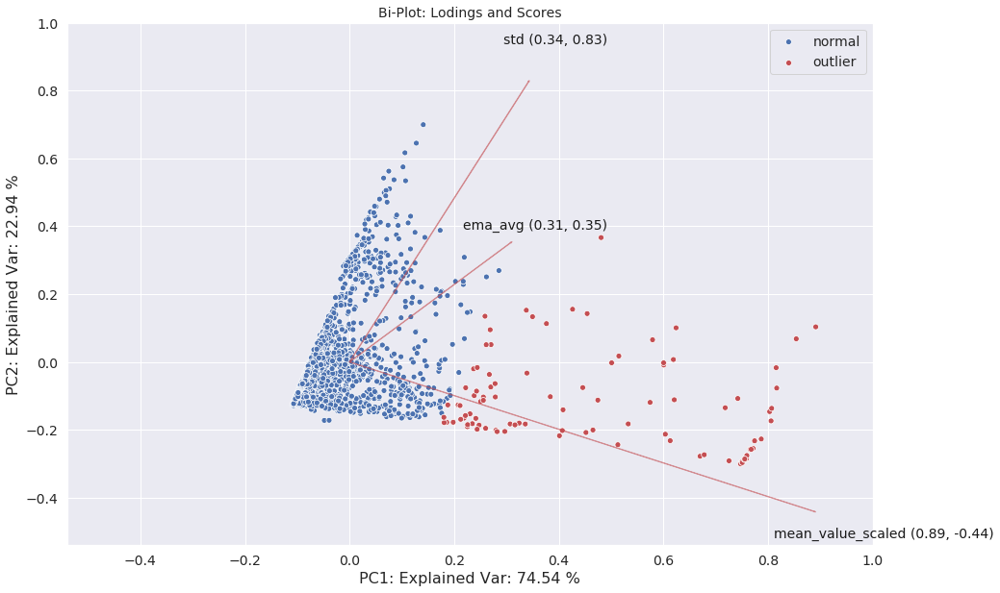
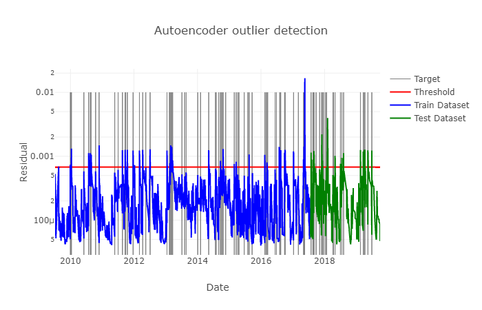
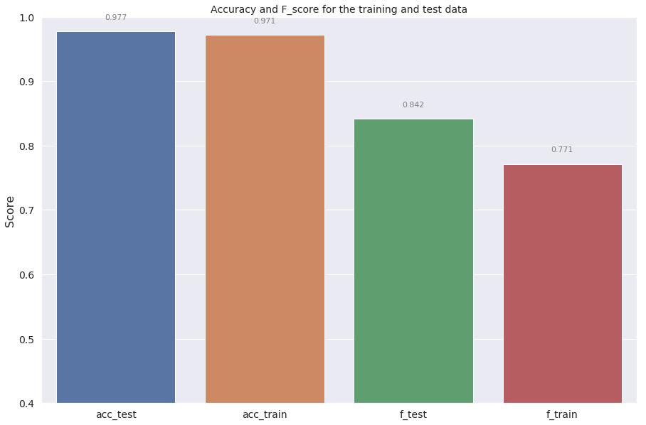
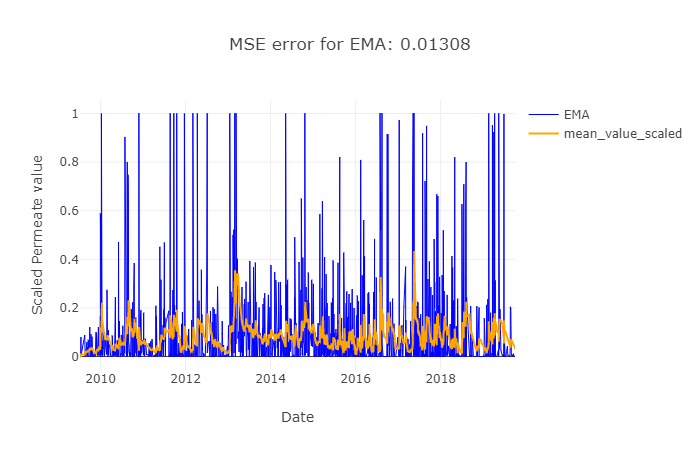
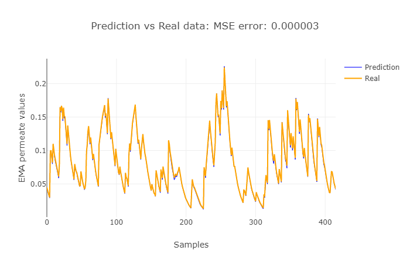

# DSND Capstone: Anomaly detection and forecasting of permeate breakthrough  
This projectis part of the course requirements for Udacity's [Data Scientist Nanodegree](https://www.udacity.com/course/data-scientist-nanodegree--nd025) certification.

All code used for the analysis can he found in the [notebook](https://github.com/PriceTT/DSND-Capstone/blob/master/5-DSND-Capstone.ipynb).

To read the blog post associated with the article, you can go [here](https://medium.com/@pricett/anomaly-detection-and-forecasting-of-permeate-breakthrough-e79a1cfaf0a9?sk=591ea1db7f4e52bfd6972bc33afb6b60).

## Executive Summary:  

### Ultrafiltration Process
In the food and biochemical industry, the use of Ultrafiltration (UF) is a key unit operation to purify the product of interest. The feed enters the UF and and based on the pore size of the membrane, substances larger than the pore size, remains in the **concentrate (product)** and substances smaller than the pore size goes into the **permeate (waste)**.  

  
*Image courtesy www.crs-reprocessing.com*

The pore size of the UF membrane, depending on the application, is on the order of 10 - 100 Kilo daltons. It is because of this, that it is possible to separate proteins, and increases the concentration of proteins in the concentrate stream by removing water and salts, leaving behind the product of interest.  

  
*Image courtesy www.synderfiltration.com*

However, over time, the membrane degrades, and the protein goes into the permeate. Since the permeate is a waste stream, we are essentially throwing out the product we wish to sell.  

### Problem Statement: 
In this project, by analyzing the historical permeate values, the aim is to detect breakthrough (high permeate values) and provide feedback to the engineers when the UF membranes should be replaced, thereby having a more reliable production process and reducing product loss. 

In other words, we wish to develop a robust methodology to predict when there is **permeate breakthrough (high levels of product in the permeate)** and predict what the future values will be.  

### Methodology

The project followed the CRISP-DM method of data exploration's six steps of:
1. Business Understanding
2. Data Understanding
3. Data Preparation
4. Modeling
5. Evaluation
6. Deployment

Given that the records of when the historical breakthrough are inconsistent, features for breakthrough will be created.
We will then evaluate methods for outlier detection (PCA and Autoencoder model) and will evaluate the use of Exponential moving averages and a more sophisticated LSTM model to forecast the future permeate values.  
The following  metrics were used to ascertain how well the model performs:  
* For anomaly detection, we will use accuracy and the F-score.
* For forecasting, we will use the mean squared error (MSE) of the test set.

### Results

#### Outlier Detection

The PCA analysis shows that the outliers can most likely be classified as shown by the red cluster below.

  

Likewise, a more advanced autoencoder model is able to capture when there is breakthrough with an Accuracy score of 0.9715, Precision score of 0.8438 and F-score of  0.7714 on the test set.

  

Below the metrics for the autoencoder model is shown

  

#### Forecasting permeate values

The simple EMA does a good job of tracking the trends but usually lags the movement of the new data as shown below. This particular analysis shows that after a major peak using the EMA, it takes about one year before there is another major peak (It is assumed the membranes are replaced after a major peak which causes a reduction of the permeate values).
This is actually a much shorter period than which the manufacture says should be closer to 2 years.

  

The LSTM does a poor job of predicting the actual permeate values but does an excellent job of predicting the EMA (shown below) and standard deviation. This can then be used to enable longer term predictions compared to just using the EMA model.

  

### Future work

Given more time, theses are areas of focus which should be investigated:

* The LSTM does a good job at predicting the mean and standard deviation of the future values. It could be interesting to evaluate if we can reconstruct the probability of what the future values would be.
* The use of gradients or % change between values should be investigated. While the moving average has been a successful feature, given that the permeate samples are not taken at regular intervals, a gradient may give more useful information.
* Evaluate different model parameters:
    - loss functions and  optimizers.
    - Activation function: relu 

### Conclusion

In this work we have evaluated various methods to predict when there is permeate breakthrough and the autoencoder model seems quite promising, but should be combined with conventional statistic process control metrics to increase its robustness.

Likewise, the EMA and LSTM provide different outcomes. The EMA smooths the time series data and gives the trend over time. This combined with the LSTM enables us to make future predictions on the trends in the future.

## Dataset

Scaled permeate data, **permeate_data.csv** has kindly been provided by **Novozymes AS**. The use of this dataset is solely to complete and assess the data mining task which is part of the  **DSND Capstone: Anomaly detection and forecasting of permeate breakthrough**  for the Udacity Data Science Nanodegree program. You are prohibited from using the **Novozymes AS** data in any other context.

The dataset, has already been cleaned and scaled and the  **mean_value_scaled** column contains the  scaled permeate values between 0 - 1.    
Product names  have been dropped and what is left are the dates when the measurement were taken **sample_created_date**. 

## Requirements 
The following  libraries were used to produce the results below: 

* cufflinks==0.16.0
* keras==2.3.0 
* matplotlib==2.1.2
* numpy==1.17.2
* pandas==0.22.0
* plotly==3.10.0
* scikit-learn==0.19.1
* scipy==1.0.0
* tensorflow==1.14.0 
